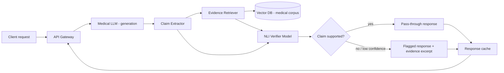

<div align="center">

# hallucination-detection-medical-llm
### Catches unsupported or fabricated claims in LLM-generated medical text before they reach a clinician or patient.

[]()
[]()
[]()
[]()

</div>
<!--
Badge notes:
- Swap the coverage number for your real number from pytest-cov / coverage.py, don't leave XX%.
- Add a badge for whichever inference backend you used (vLLM, TGI, HF) if it's central to the project.
- Don't add more than 4-5 badges. A badge row with 10 badges reads as decoration, not signal.
-->

## Demo

<!--
Put this ABOVE the problem statement, not below it. Reviewers give a repo about
90 seconds before deciding whether to keep reading. A 15-20 second screen
recording (GIF or linked video) showing: input a medical query with a
plausible-but-wrong claim -> system flags it -> shows the evidence it used to
flag it. That loop is the whole pitch in one clip.

If you don't have a recording yet, use a static screenshot of the output with
a flagged claim highlighted, and a one-line caption under it, e.g.:

"Input claim: 'Metformin is first-line for type 1 diabetes.'
 Output: flagged (confidence 0.91) — contradicted by retrieved guideline text."
-->


## Problem

Medical LLMs generate fluent, confident-sounding text regardless of whether the underlying claim is true. A model can state a drug interaction, dosage, or contraindication that sounds exactly as authoritative as one that's correct — there's no signal in the output itself that distinguishes the two. In a clinical or patient-facing context, that's not a quality bug, it's a safety bug: a wrong answer stated confidently is worse than the system refusing to answer, because it removes the human's instinct to double-check. This project builds a layer that sits between generation and the end user, scores each factual claim against retrieved source evidence, and surfaces the ones that aren't actually supported — so the failure mode changes from "silently wrong" to "flagged for review."

## Architecture

<!--
This is the section that gets read most closely. Build this in Mermaid so it
renders directly on GitHub (no exported image to keep in sync). Below is a
skeleton for a typical claim-verification pipeline — replace with your real
services/data flow. Show the FULL request lifecycle: where the query enters,
where retrieval happens, where the base LLM generates, where the verifier
model scores claims, and where caching/queueing sit if you have them.
-->



Request lifecycle, in words: a query comes in, the base LLM generates a draft response, the claim extractor breaks that response into atomic factual statements, each statement is checked against evidence pulled from a retrieval index over trusted medical sources, and a verifier model (NLI-style entailment check, not just embedding similarity) decides support/contradiction/not-enough-evidence per claim. Only the final decision — pass or flag with evidence — goes back to the client.

## Key design decisions

<!-- 3-5 of these, format: chose X over Y because Z. Fill in your real ones. -->

- Used a separate NLI-based verifier model instead of relying on the generator's own confidence scores, because LLM confidence and factual correctness are only weakly correlated — self-reported certainty isn't a reliable signal here.
- Chose claim-level verification (decomposing the response into atomic statements) over whole-response verification, because a single response mixing one wrong dosage with four correct statements needs the wrong one isolated, not the whole response thrown out.
- [fill in: retrieval choice — e.g. why a specific vector DB, why a specific chunking strategy for medical documents]
- [fill in: how you handled the "not enough evidence" case vs "contradicted" case — these should not be treated the same]
- [fill in: latency/accuracy tradeoff — e.g. why you didn't verify every single claim, or why you batch verification calls]

## Tech stack

| Layer | Choice |
|---|---|
| Generation LLM | [fill in] |
| Claim extraction | [fill in] |
| Verifier / NLI model | [fill in] |
| Retrieval / vector store | [fill in] |
| Medical corpus source | [fill in] |
| API layer | [fill in] |
| Caching | [fill in] |
| Observability | [fill in] |
| Infra | [fill in] |

## Evaluation

<!--
For a hallucination-detection project this replaces "performance/scale numbers"
almost entirely — the number that matters most here is detection accuracy,
not throughput. Report both. Don't say "highly accurate," report the actual
precision/recall on a labeled eval set, even if the eval set is small and
synthetic. Say so if it's synthetic.
-->

Evaluated on [N] claims labeled supported / contradicted / unverifiable, drawn from [source — e.g. MedHallu, a subset you labeled yourself, synthetic perturbations of guideline text].

| Metric | Value |
|---|---|
| Precision (flagging hallucinated claims) | [fill in] |
| Recall | [fill in] |
| F1 | [fill in] |
| End-to-end latency (p50 / p95) | [fill in] |
| Verifier throughput (claims/sec) | [fill in] |

Be honest about the eval set size and source in one sentence — a 200-claim eval set is fine, but say it's 200, don't imply it's larger.

## How to run it

```bash
git clone https://github.com/<you>/hallucination-detection-medical-llm.git
cd hallucination-detection-medical-llm
cp .env.example .env   # add API keys / model paths
docker compose up --build
```

Runs on `localhost:8000` by default. Sample request:

```bash
curl -X POST localhost:8000/verify \
  -H "Content-Type: application/json" \
  -d '{"query": "your medical question here"}'
```

## What I'd improve next

- [fill in: e.g. the verifier currently checks claims independently, so it misses hallucinations that only become apparent when two claims contradict each other — needs cross-claim consistency checking]
- [fill in: e.g. retrieval corpus is limited to X source, so anything outside its coverage gets marked "unverifiable" rather than correctly flagged]
- [fill in: e.g. no human-in-the-loop feedback mechanism yet to correct false positives over time]

## License

MIT — see [LICENSE](LICENSE).

Questions / feedback: [your email or GitHub handle]
